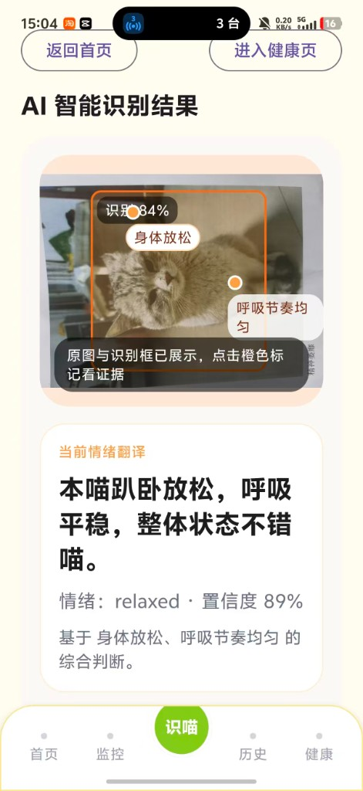

# 树洞喵（ShudongMiao）

面向宠物猫的 **情绪 + 健康识别** 助手：支持图片、短视频与实时画面分析，结合 **图文混合知识库** 与 **规则化风险引擎**，输出结构化结论、照护建议与可追问的对话。

> 工程代号：`Cat Agent`（包名 `com.catagent`）。仓库包含 **FastAPI 后端** 与 **Android（Jetpack Compose）客户端**。

---

## 功能概览

| 能力 | 说明 |
| --- | --- |
| 媒体分析 | 拍照 / 录像 / 相册选图选视频，提交后端结构化分析 |
| 多轮追问 | 基于会话继续补充上下文（`followup`） |
| 实时观察 | 摄像头连续帧分析，带稳定性策略与知识卡片展示 |
| 实时通话 | 语音输入 + 连续分析 + TTS 播报（含高风险提示） |
| 结果可视化 | 原图或视频首帧 + 猫目标检测框叠加 |
| 历史与健康 | 情绪档案、健康报告等页面（含演示模式） |
| 知识联通 | 每次识别都会在结果中附带命中的知识条目 |
| 防复读保护 | 不同输入若输出完全一致会被降级为“待确认”，避免塌缩 |

---

## 功能截图讲解

> 以下为实机识别产物的讲解。示例图位于 `docs/screenshots/`。

### 1. 识别结果详情页



- **顶部导航**：`返回首页` / `进入健康页`，从结果页可直达长期健康档案。
- **识别框可视化**：在原图上叠加猫目标框，并标注识别置信度与当前情绪关键词（如 `身体放松`、`呼吸节奏均匀`）。点击橙色标记可查看模型提供的视觉依据。
- **当前情绪翻译**：使用 **猫咪第一人称** 输出本次判断与风险说明，字段包括：
  - `summary`（摘要）
  - `emotion_assessment.primary`（如 `relaxed / happy / excited / curious / confused / stress_alert / pain_sign` 等）
  - `confidence`（置信度，会被解析层二次校准）
  - `basis`（基于什么视觉线索得到的综合判断）
- **底部 Tab**：`首页 / 监控 / 识喵 / 历史 / 健康`，识喵按钮为主要识别入口。

### 2. 演示模式（稳定日 / 风险日）

- 首页顶部内置 **演示模式切换卡片**：可一键切换 `稳定日 / 风险日`，联动 **监控 / 历史 / 今日总结** 三处 mock 数据。
- 用于现场演示控场；真实识别结果仍走后端接口，不受切换影响。

### 3. 实时观察 / 实时通话

- 支持 **连续帧识别**，在出现 `no_cat`、模糊或置信度不足时自动降级，不会沿用上一只猫的结果。
- 识别出新目标并证据足够时，会 **快速切换结果**，避免“识别什么都一样”的塌缩。
- 实时通话额外支持语音输入与 TTS 播报，高风险时减少卖萌词，优先表达关键信息。

---

## 识别准确性保障（工程向）

这部分从底层保证“**不会什么都识别成同一个结果**、**非猫不误判、知识库可见联通**”。

- **物种与可见性闸门**（`backend/app/services/response_parser.py`）
  - 检测到 `狗 / 犬类 / 画面主体非猫` 时强制转为 `no_cat` 并清除猫目标框。
  - 画面模糊、过暗、目标过小或框置信度过低时降级为 `unknown`，避免幻觉高风险。
- **情绪细粒度标签**
  - 扩展标签集：`happy / excited / curious / confused / relaxed / stress_alert / fearful / low_energy / pain_sign / litterbox_discomfort / no_cat / unknown`。
  - 解析层会基于 `summary / signals / evidence.visual` 关键词做二次细分（如 `反复张望 -> curious`、`龇牙咧嘴 -> fearful`），并对否定短语（如 `不开心`）做特判，不再误映射到正向标签。
- **风险引擎兜底**（`backend/app/services/risk_engine.py`）
  - 高风险 / 紧急必须满足双证据（视觉 + 文本），否则自动降级到 `medium`。
  - 否定语（“没有呕吐/没有排尿困难”）不会错误触发高风险规则。
  - 实时链路带 2/3 帧确认、冷却期、弱信号保护，减少抖动。
- **知识库联通可见**（`backend/app/services/analyzer.py`）
  - 每次识别都会检索 **文本 + 视觉** 混合知识片段，并兜底写入 `evidence.knowledge_refs` 的 `doc_id`，客户端展示“命中知识”。
- **反模板复读守卫**
  - 当输入媒体指纹已变化，但输出核心字段（情绪 / 风险 / 摘要）完全相同，自动降级为“待确认结果并提示重拍”。

---

## 仓库结构

```text
.
├── backend/                 # FastAPI：分析编排、模型客户端、知识检索、解析与风险规则
│   ├── app/
│   ├── knowledge/           # Markdown 知识库 + docx 导入产物等
│   ├── scripts/             # 本地启动、docx 导入、回归测试脚本
│   └── tests/               # pytest
├── android/                 # Kotlin + Compose 客户端
│   └── app/
├── docs/
│   └── screenshots/         # README 讲解用截图
└── README.md
```

---

## 快速开始：后端

### 环境要求

- Python 3.11+（`run_local_backend.sh` 使用 `python3.11` 创建虚拟环境）
- 可访问上游 **MiniCPM** WebSocket 服务（或通过 Mock 调试）

### 启动

在项目根目录：

```bash
cd backend
./scripts/run_local_backend.sh
```

默认监听：`http://0.0.0.0:8000`

### 常用 HTTP 接口

| 方法 | 路径 | 说明 |
| --- | --- | --- |
| GET | `/api/v1/health` | 健康检查 |
| POST | `/api/v1/analyze` | 图片/视频分析 |
| POST | `/api/v1/chat/followup` | 追问 |
| POST | `/api/v1/realtime/frame` | 实时单帧分析 |
| GET | `/api/v1/session/{session_id}` | 会话信息 |

完整契约以 OpenAPI 为准（启动后访问 `/docs`）。

### 主要环境变量（节选）

| 变量 | 说明 |
| --- | --- |
| `MINICPM_WS_URL` | MiniCPM WebSocket 地址 |
| `MINICPM_USE_MOCK` | 设为 `1` 时使用 Mock，便于无上游时联调 |
| `KNOWLEDGE_DIR` | 知识库目录，默认 `backend/knowledge` |
| `CAT_AGENT_TEMP_DIR` | 临时文件目录 |

详见 `backend/app/settings.py`。

### 后端测试

```bash
cd backend
. .venv/bin/activate
python -m pytest
```

若尚未创建虚拟环境，可先运行一次 `./scripts/run_local_backend.sh`（会自动创建 `.venv` 并安装常用依赖）。

### 一键识别多样性回归

用于快速验证“**不会所有图都输出同一结果**”以及“**知识库是否联通**”：

```bash
backend/.venv/bin/python backend/scripts/regression_emotion_diversity.py \
  --endpoint http://127.0.0.1:8000/api/v1/analyze \
  --samples 20 --seed 11
```

输出包括：

- `UNIQUE_PRIMARY` / `PRIMARY_DISTRIBUTION`：情绪标签数量与分布
- `DUP_PRIMARY_SUMMARY_RATIO`：相同“情绪 + 摘要”在样本中的重复率（越低越好）
- `KNOWLEDGE_REF_HIT_RATIO`：`evidence.knowledge_refs` 命中率
- `RETRIEVED_KNOWLEDGE_HIT_RATIO`：`retrieved_knowledge` 命中率
- 每张图的识别详情（`primary / risk / summary / refs`）

---

## 快速开始：Android

### 环境要求

- JDK 17+
- Android SDK（`compileSdk 35`，`minSdk 30`）

在 `android/` 下创建 `local.properties`（若本地尚无），例如：

```properties
sdk.dir=/你的路径/Android/sdk
```

### 配置后端地址

默认在 `android/app/build.gradle.kts` 中通过 `CAT_AGENT_BASE_URL` 注入 `BuildConfig.BASE_URL`。手机与电脑 **需在同一局域网**，并将地址改为 **你电脑的局域网 IP**：

```bash
cd android
./gradlew assembleDebug -PCAT_AGENT_BASE_URL=http://你的电脑IP:8000/
```

或使用脚本（若仓库内提供）：

```bash
cd android
./scripts/build_debug.sh -PCAT_AGENT_BASE_URL=http://你的电脑IP:8000/
```

### 构建 Debug APK

```bash
cd android
./gradlew assembleDebug
```

产物路径：

```text
android/app/build/outputs/apk/debug/app-debug.apk
```

### 联调注意

- 后端需监听 `0.0.0.0`（脚本默认），本机防火墙放行 `8000`
- 手机与电脑需在同一 Wi‑Fi；跨网段或移动网络需自行解决可达性（如公网部署、VPN 等）

---

## 设计要点（工程向）

- **准确性**：物种/可见性闸门、`no_cat` 与 **非猫目标** 的后处理、解析层硬校验、风险引擎兜底。
- **知识增强**：文本 + 图像特征的混合检索，同义词与否定语义、风险词加权等（见 `backend/app/services/retriever.py`）。
- **实时稳定**：连续帧状态确认、弱信号保护、UI/播报节流，减轻抖动与误报。
- **人格与专业**：默认猫咪第一人称输出；高风险场景减少卖萌修辞、优先清晰可执行。
- **可观测性**：分析链路中记录模型、解析与总耗时（便于评估优化对延迟的影响）。

---

## 上游模型与数据格式说明

- 真实服务返回事件流通常为：`prefill_done` → `chunk(text_delta)` → `done(text)`。
- 多媒体在发送给上游时多为 **纯 base64**；客户端/适配层会处理 `data:*;base64,` 前缀。

---

## 许可证

若需开源许可证，请在仓库中补充 `LICENSE` 文件（当前未默认添加）。

---

## 贡献与问题

欢迎通过 Issue / PR 交流。提交前建议在后端运行 `python -m pytest`，并确保 Android 工程可成功 `assembleDebug`。
